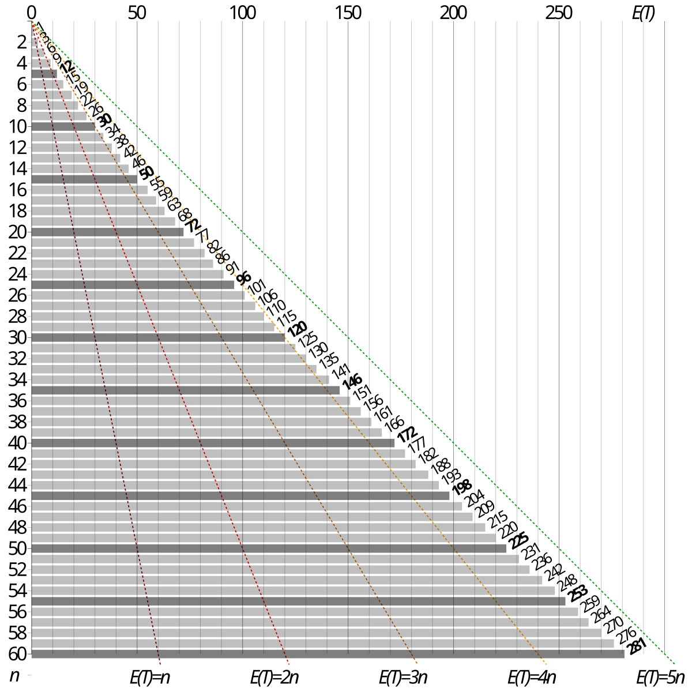

# João's Portfolio

Welcome to my GitHub portfolio! I’m João, a Data Scientist with a background in Accounting.

In here, you’ll find some of the private projects and experiments I’ve worked on, including my master’s thesis!
Most projects are fully open-source, and as such are available under the MIT License.

## Skills and Technologies
- **Languages**: Python, R, SQL
- **Libraries**: Pandas, Numpy, Matplotlib, Seaborn, Scikit-learn, TensorFlow
- **Tools**: Jupyter Notebooks

## Projects

### 1. [Master’s Thesis: "Decoding the numbers and language behind financial statement fraud"](https://github.com/JoaoBrasOliveira/portfolio/tree/main/masters_thesis)

Tags: `Large Language Models`, `Fraud detection`, `Financial statements`, `Securities and Exchange Comission`.

  

### 2. [Forecasting the Prices of Ethereum (ETH)](https://github.com/JoaoBrasOliveira/portfolio/tree/main/ethereum_prices)
Used time-series techniques to predict in and out-of-sample prices for the cryptocurrency Ethereum price movements using various time series forecasting techniques.

Techniques used include ARIMA, Prophet, and LSTM and GRU neural networks.

Tags: `Deep Learning`, `Forecasting`, `Ethereum`, `Time-series`.

  
   
  Image Credit: Photo by <a href="https://unsplash.com/pt-br/@zoltantasi">Zoltan Tasi</a> on Unsplash</a>

### 3. [Sentiment Analysis of Amazon Reviews](https://github.com/JoaoBrasOliveira/portfolio/tree/main/sentiment_analysis)
Applied natural language processing to analyze sentiment in reviews posted within Amazon´s marketplace using machine learning models.

Tools used: NLTK, Scikit-learn.

Tags: `NLP`, `Sentiment analysis`, `Customer Reviews`, `Transformers`.

  
   
  Image Credit: Photo by <a href="https://unsplash.com/@mahdibafande">Mahdi Bafande</a> on Unsplash</a>

### 4. [Pokémon Trading Card Game Pocket (TCGP) - An Analysis of Greed](https://github.com/JoaoBrasOliveira/portfolio/tree/main/pokemontcgp_greed)
Applied natural language processing to analyze sentiment in reviews posted within Amazon´s marketplace using machine learning models.

Tools used: NLTK, Scikit-learn.

Tags: `NLP`, `Sentiment analysis`, `Customer Reviews`, `Transformers`.

  
   
  Image Credit: Photo by <a href="https://commons.wikimedia.org/wiki/User:Cmglee">Cmglee</a> on Wikipedia</a>

### 5. [Chess playing bot](https://github.com/JoaoBrasOliveira/portfolio/tree/main/chessbot)
Applied natural language processing to analyze sentiment in reviews posted within Amazon´s marketplace using machine learning models.

Tools used: NLTK, Scikit-learn.

Tags: `NLP`, `Sentiment analysis`, `Customer Reviews`, `Transformers`.

  
   
  Image Credit: Photo by <a href="https://www.chess.com/article/view/how-chess-games-can-end-8-ways-explained">Chess.com</a></a>

