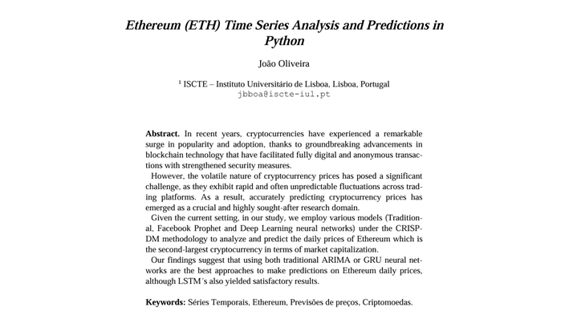

# Forecasting the prices of Ethereum (ETH)
## Project Overview

**Introduction:** This project utilized a plethora of models to establish comparrisons between them for the Ethereum price prediction task.

**Objective:** The goal was to to obtain the most accurate forecasts possible for the daily Ethereum values by exploring a range of forecasting techniques, including classical statistical methods such as ARIMA (AutoRegressive Integrated Moving Average) methods, deep learning models such as recurrent neural networks (RNN) and long-short term memory (LSTM) networks, as well as Facebook Prophet.

### Resources

  
<strong>Click the image below to access the full report on Time-Series Analysis</strong>

  

## Dataset Description

**Source:** The dataset used has Coinbase as source, is public, and was taken from the Federal Reserve Bank of Saint Louis (FRED). It is available at the following link: [https://fred.stlouisfed.org/series/CBETHUSD]. Or available in the [data folder here](./data).

**Structure:** The dataset contained the date and the daily price of the cryptocurrency Ethereum (as of 5 PM PST).

## To Reproduce

**Codebase:** Complete code for data extraction, preprocessing, model training, and evaluation is available in this repository.

**Documentation:** The notebook is documented with very clear instructions, guiding the main script executions, and result interpretations.
