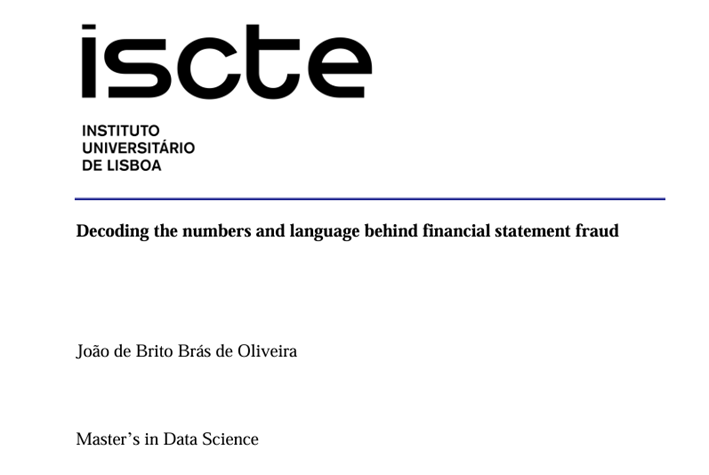

# Master’s Thesis: "_Decoding the numbers and language behind financial statement fraud_"
## Project Overview

**Introduction:** Financial statement fraud is, a form of intentional misstatements or omissions of amounts or disclosures in financial statements designed to deceive financial statement users. External stakeholders often struggle to grasp the company's true financial situation until it is already too late, and the losses are practically irrecoverable. This highlights the need for fraud detection tools that can identify patterns and expedite the detection process, reducing costs and improving efficiency by helping direct investigations.

**Objective:** The thesis had three main research goals:
- To understand how different ways of dealing with Large Language Models max token input affected classification performance in financial statement fraud detection problems;
- To determine how Large Language Models fared against benchmark models;
- To learn if Large Language Model could assist stakeholders in signalling textual indicators/“_red-flags_” within the _Management´s Discussion and Analysis_ (MD&A) section of 10-K reports.

## Resources

  
<strong>Click the image below to access the full text of the Thesis</strong>

  

## Dataset Description

**Sources:** The data used was obtained via a combination of several distinct data sources and was only possible after many failures in information retrieval attempts via API´s which had incorrect information. As such the main data sources where:
- Dechow, Ge, Larson and Sloan (2011)/USCMarshall dataset, available for purchase at the following link: [https://sites.google.com/usc.edu/aaerdataset/home?authuser=0];
- Loukas, L., Fergadiotis, M., Androutsopoulos, I., & Malakasiotis, P. (2021)/EDGAR-CORPUS dataset, freely available at the following link: [https://huggingface.co/datasets/eloukas/edgar-corpus];
- Bao, Y., Ke, B., Li, B., Yu, Y. J., & Zhang, J. (2019) dataset, freely available at the author´s GitHub via the following link:[https://github.com/JarFraud/FraudDetection].

As part of the data used is proprietary it is not possible to share the datasets openly. All authors have been given due credit.

**Structure:** The final dataset included a total of 1.850 filings, split between those involved in fraudulent (414 filings) and non-fraudulent activities (1.436 filings). For each of these filings the dataset contained the following variables:
- The text contents of the (MD&A) section;
- 42 financial variables (28 raw accounting variables + 14 financial ratios);
- The binary target label (0 - Non-Fraud and 1 - Fraud).

## To Reproduce

**Codebase:** Complete code for data extraction, preprocessing, model training, and evaluation is available in this repository.

**Documentation:** The thesis report provides very clear instructions on the steps followed and the code can guide along the main operations executed.
